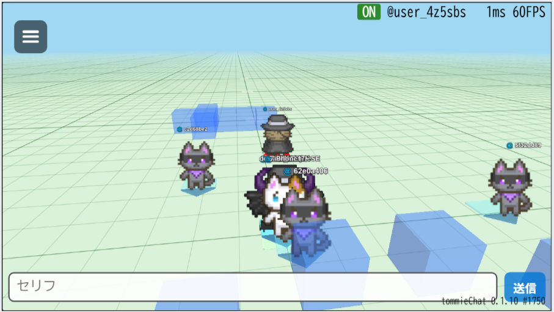
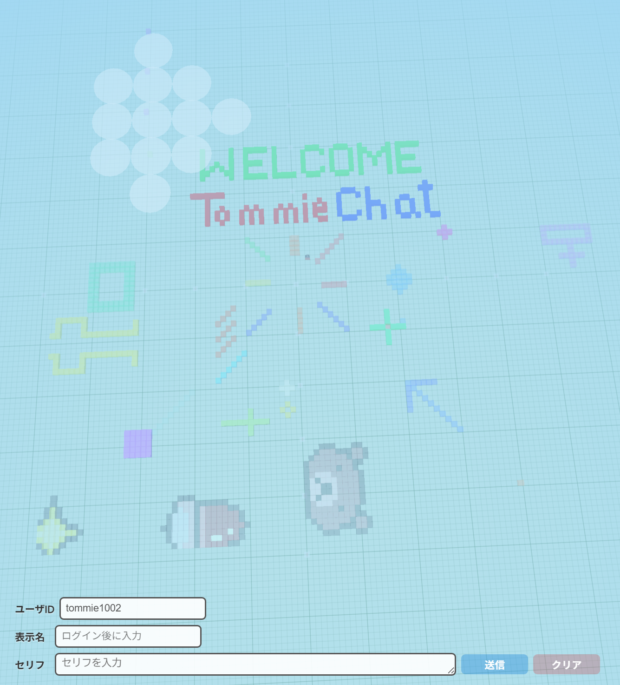

# tommieChat

[English](README.md) | [日本語](README.ja.md)

[](LICENSE)
[](https://www.babylonjs.com/)
[](https://heroiclabs.com/nakama/)
[](https://go.dev/)
[](https://www.typescriptlang.org/)
[](https://docs.docker.com/compose/)
[](https://www.postgresql.org/)

2026/04/01 更新

> **プロジェクトの状態:** 現在、鋭意開発中です。実験的にサーバーを公開しています: [mmo.tommie.jp](https://mmo.tommie.jp)

ブラウザで動く3D MMOチャットゲームです。
Babylon.js + Nakama で構築されたリアルタイムマルチプレイヤー環境で、ブロックを置いたりチャットしたりできます。

## 目次

1. [スクリーンショット](#1-スクリーンショット)
2. [特徴](#2-特徴)
3. [技術スタック](#3-技術スタック)
4. [必要な環境](#4-必要な環境)
5. [セットアップ](#5-セットアップ)
6. [ポート番号](#6-ポート番号)
7. [操作方法](#7-操作方法)
8. [ディレクトリ構成](#8-ディレクトリ構成)
9. [ドキュメント](#9-ドキュメント)
10. [開発ツール](#10-開発ツール)
11. [貢献](#11-貢献)
12. [ライセンス](#12-ライセンス)
13. [作者](#13-作者)

## 1. スクリーンショット

*スクリーンショットは開発中のもので、今後大幅に変わることがあります。*





## 2. 特徴

- ブラウザだけで動作（インストール不要）
- PWA対応（ホーム画面に追加してフルスクリーンで利用可能）
- 3Dワールドでリアルタイムチャット（セリフ吹き出し表示）
- スプライトベースのアバターシステム
- ブロック配置によるワールド編集
- 複数ユーザーの同時接続に対応
- デバイス認証によるかんたんログイン
- MinIOによるアセットストレージ

## 3. 技術スタック

| 項目 | 技術 |
|---|---|
| 3Dエンジン | [Babylon.js](https://www.babylonjs.com/) 8.x |
| ゲームサーバー | [Nakama](https://heroiclabs.com/nakama/) 3.35 |
| サーバーロジック | Go |
| フロントエンド | TypeScript |
| ビルドツール | Vite |
| データベース | PostgreSQL 16 |
| オブジェクトストレージ | [MinIO](https://min.io/) |
| コンテナ | Docker Compose |

## 4. 必要な環境

### 開発環境

- Node.js v24+（フロントエンドのビルドに必要）
- Docker / Docker Compose（サーバ起動に必要）

### 本番環境

- Docker / Docker Compose のみ（ビルド済み `dist/` を配置）

### ブラウザ

- スマートフォン対応（iOS Safari, Android Chrome）
- WebGL 2.0 対応ブラウザ（Chrome, Edge, Firefox, Safari）

## 5. セットアップ

### 5.1 リポジトリのクローン

```bash
git clone https://github.com/tommie-jp/tommie-chat.git
cd tommie-chat
```

### 5.2 クライアント（フロントエンド）

```bash
npm install
npm run build
```

### 5.3 サーバー（Nakama）

```bash
# 環境変数の設定
cp nakama/.env.example nakama/.env

# サーバー起動
cd nakama && docker compose up -d && cd ..

# Go プラグインのビルド＆反映
bash nakama/doBuild.sh --fresh
```

### 5.4 ブラウザで確認

<http://localhost> を開きます（nginx 経由で `dist/` を配信）。

開発中は `npm run dev` で Vite 開発サーバー (<http://localhost:5173>) も使えます。

Nakama 管理ダッシュボード: <http://localhost:7351>（初期ユーザー: `admin` / `password`）

### 5.5 テスト

```bash
# 型チェック
npm run check

# ユニットテスト
npm test

# 統合テスト（Nakamaサーバー起動中に実行）
bash test/doAll.sh

# 全ファイル文法チェック
bash test/doLint.sh
```

## 6. ポート番号

| ポート | 用途 |
|---|---|
| 80 | Web フロントエンド (nginx) |
| 5173 | Vite 開発サーバー |
| 5432 | PostgreSQL |
| 6060 | Go pprof プロファイラ |
| 7349 | Nakama gRPC API |
| 7350 | Nakama クライアント API |
| 7351 | Nakama 管理ダッシュボード |
| 9090 | Prometheus メトリクス |

## 7. 操作方法

- **ログイン**: ユーザIDを入力してログインボタン
- **移動**: クリックまたはタップで移動先を指定
- **ブロック配置**: Bキー + クリック（スマホ: 未対応）
- **チャット**: 下部のテキスト入力欄からメッセージ送信
- **カメラ**: ドラッグまたはスワイプで回転

## 8. ディレクトリ構成

```text
tommieChat/
├── src/                  # クライアント側ソースコード (TypeScript)
│   ├── main.ts           # エントリーポイント
│   ├── GameScene.ts      # Babylon.js ゲームシーン
│   ├── NakamaService.ts  # Nakama サーバー通信
│   ├── UIPanel.ts        # UI パネル
│   ├── AOIManager.ts     # AOI (Area of Interest) 管理
│   ├── AvatarSystem.ts   # アバター管理
│   ├── SpriteAvatarSystem.ts # スプライトアバターシステム
│   ├── ChunkDB.ts        # チャンクデータベース
│   ├── CloudSystem.ts    # 雲エフェクト
│   ├── NPCSystem.ts      # NPC 管理
│   ├── Profiler.ts       # パフォーマンス計測
│   ├── WorldConstants.ts # ワールド定数
│   └── DebugOverlay.ts   # デバッグオーバーレイ
├── public/               # 静的アセット
│   ├── textures/         # テクスチャ (.ktx2)
│   ├── manifest.json     # PWA マニフェスト
│   └── sw.js             # Service Worker
├── nakama/               # サーバー側
│   ├── docker-compose.yml
│   ├── go_src/           # Go サーバープラグイン (main.go)
│   ├── nginx.conf        # リバースプロキシ設定
│   ├── doBuild.sh        # プラグインビルドスクリプト
│   └── doRestart.sh      # サーバー再起動スクリプト
├── test/                 # テストスクリプト・テストコード
│   ├── doAll.sh          # 全テスト一括実行
│   ├── doLint.sh         # 文法チェック
│   ├── doNight.sh        # 夜間長時間テスト
│   ├── doTest-*.sh       # 各種テストスクリプト
│   ├── nakama-*.test.ts  # Vitest テストファイル
│   └── log/              # テストレポート出力先
├── doc/                  # ドキュメント
├── pic/                  # 画像素材・変換スクリプト
├── .github/              # GitHub Actions / Dependabot
├── index.html            # メイン HTML
├── package.json
├── vite.config.ts
├── vitest.config.ts
└── tsconfig.json
```

## 9. ドキュメント

`doc/` ディレクトリに詳細ドキュメントがあります。

| ドキュメント | 内容 |
|-------------|------|
| [03-nakama-サーバ構築](doc/03-nakama-サーバ構築.md) | Nakama サーバの構築手順 |
| [04-DB-同接データ](doc/04-DB-同接データ.md) | 同接データの DB 設計 |
| [05-ユーザID削除](doc/05-ユーザID削除.md) | ユーザ ID 削除手順 |
| [06-nakama-チューニング](doc/06-nakama-チューニング.md) | サーバチューニングパラメータ |
| [07-MinIO-アセットストレージ](doc/07-MinIO-アセットストレージ.md) | MinIO アセットストレージ |
| [10-ブラウザ側ファイル構成](doc/10-ブラウザ側ファイル構成.md) | フロントエンドのファイル構成 |
| [11-RPC関数一覧](doc/11-RPC関数一覧.md) | サーバ RPC 関数の一覧 |
| [20-ブラウザプロファイル](doc/20-ブラウザプロファイル.md) | ブラウザ側パフォーマンス計測 |
| [21-nakamaサーバプロファイル](doc/21-nakamaサーバプロファイル.md) | サーバ側プロファイリング |
| [30-テストスクリプト一覧](doc/30-テストスクリプト一覧.md) | テストスクリプトとオプション |
| [40-デプロイ手順](doc/40-デプロイ手順.md) | さくらVPS デプロイ手順 |
| [42-LAN接続手順](doc/42-LAN接続手順.md) | LAN 接続手順 |
| [43-スマホ表示テスト](doc/43-スマホ表示テスト.md) | スマホ表示テスト |
| [51-SpriteViewerデモ](doc/51-SpriteViewerデモ.md) | SpriteViewer デモ |

## 10. 開発ツール

本プロジェクトの設計・実装・テスト・ドキュメント作成において、[Claude Code](https://docs.anthropic.com/en/docs/claude-code)（Anthropic）を全面的に活用しています。

## 11. 貢献

[CONTRIBUTING.md](CONTRIBUTING.md) をご覧ください。

## 12. ライセンス

[MIT License](LICENSE)

## 13. 作者

- tommie.jp
- X: [@tommie_nico](https://x.com/tommie_nico)
