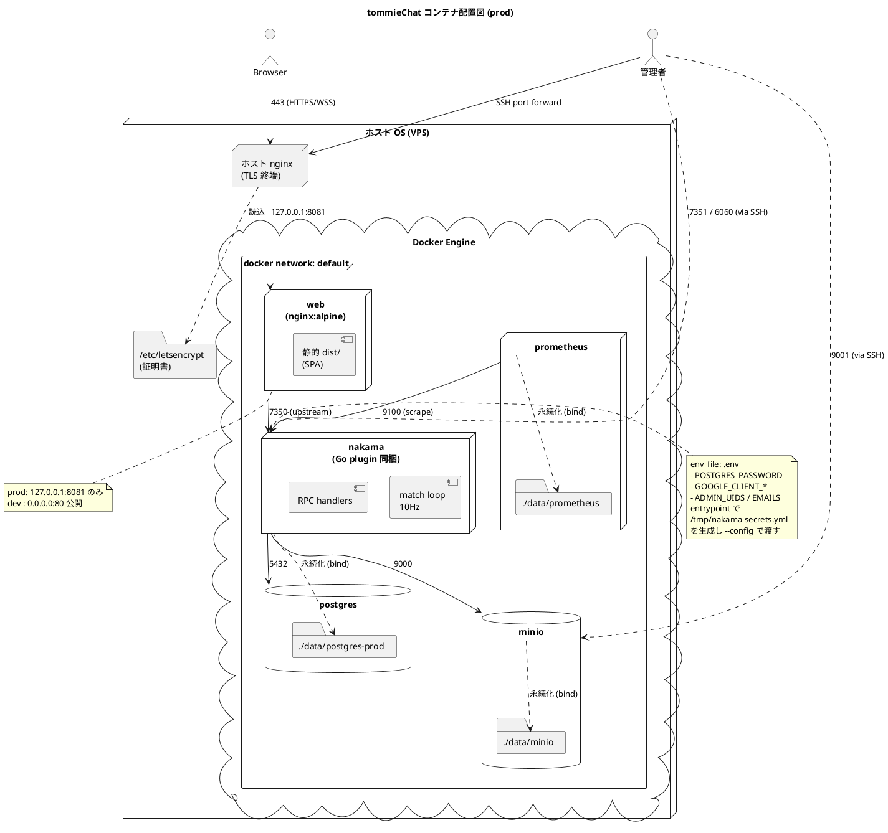
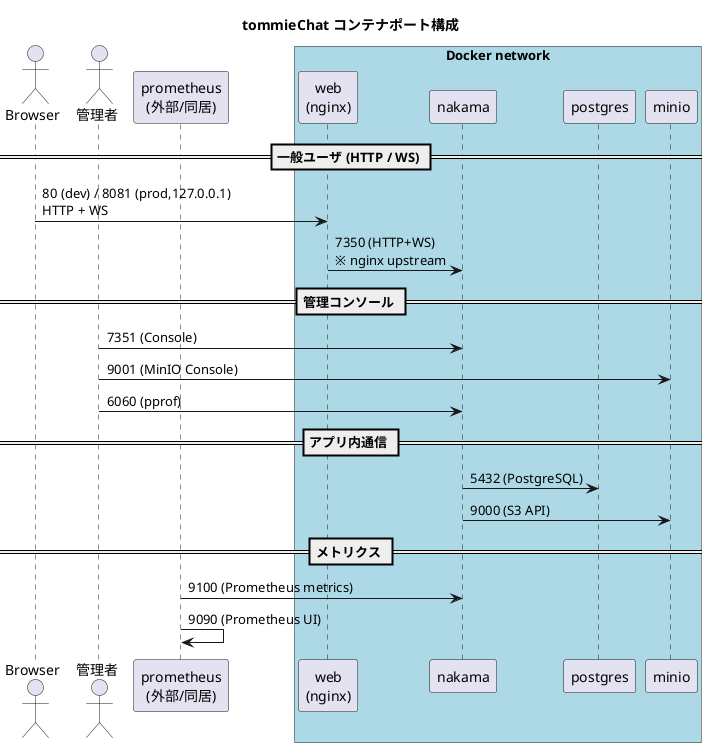

# コンテナポート構成

tommieChat を構成する Docker コンテナ群のポートマッピングを、ブラウザ/管理者から見た通信の流れとしてまとめる。

## 概要

- dev 環境: [docker-compose.dev.yml](../nakama/docker-compose.dev.yml) で nginx を `0.0.0.0:80` に公開。それ以外のサービスも外部から到達可能。
- prod 環境: [docker-compose.prod.yml](../nakama/docker-compose.prod.yml) で **nginx 以外は `127.0.0.1` バインド**。外部からはホスト側 nginx (TLS 終端) 経由でのみ到達する。

## 配置図 (PlantUML)

コンテナの物理配置、ホスト側バインド、ボリューム、ネットワーク境界を示す。prod overlay を前提とする。

## シーケンス図 (PlantUML)

ポート番号を矢印ラベルとして、ブラウザ・管理者・Prometheus から各コンテナへの通信経路を表す。

## ポートマッピング一覧

`docker-compose.yml` ベース + dev/prod overlay の最終値。prod 列の `127.0.0.1:` は「ホスト側 loopback のみバインド」を意味する。

| サービス | コンテナ内ポート | dev 公開 | prod 公開 | 用途 |
| --- | --- | --- | --- | --- |
| web (nginx) | 80 | `0.0.0.0:80` | `127.0.0.1:8081` | HTTP + WS (ユーザ導線) |
| nakama | 7350 | `7350` | `127.0.0.1:7350` | HTTP API + WebSocket |
| nakama | 7351 | `7351` | `127.0.0.1:7351` | 管理コンソール |
| nakama | 7349 | `7349` | `127.0.0.1:7349` | gRPC |
| nakama | 6060 | `6060` | `127.0.0.1:6060` | pprof プロファイリング |
| nakama | 9100 | `9100` | `9100` | Prometheus metrics エクスポート |
| postgres | 5432 | `5432` | `127.0.0.1:5432` | DB 接続 (通常は nakama からのみ) |
| minio | 9000 | `9000` | `127.0.0.1:9000` | S3 API (アセット配信) |
| minio | 9001 | `9001` | `127.0.0.1:9001` | MinIO 管理コンソール |
| prometheus | 9090 | `9090` | `127.0.0.1:9090` | Prometheus UI |

## 補足

- prod では外部公開は **ホスト側 nginx が握る 443/80 のみ**。コンテナ側の `127.0.0.1:XXXX` はホスト上の運用者 (SSH ポートフォワード等) からのアクセス用。
- ポートは `nakama/.env` で上書き可能 (`POSTGRES_PORT` / `NAKAMA_API_PORT` / `WEB_PORT` など)。同一 VPS に複数環境を並列運用する場合の手順は [40-デプロイ手順.md](40-デプロイ手順.md) §4.3 を参照。
- `COMPOSE_PROJECT_NAME` を切り替えればネットワーク名・コンテナ名が分離されるので、dev / staging / prod を同居させられる。
