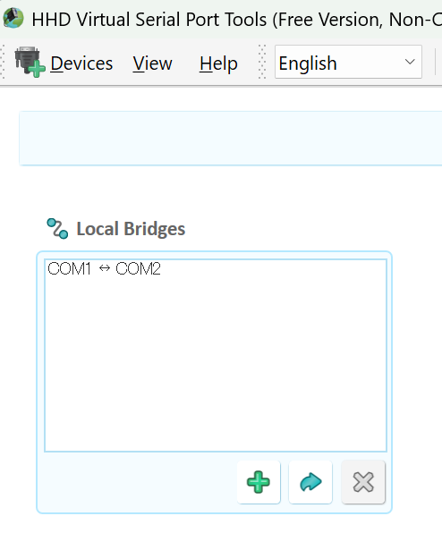
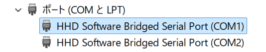

## COMxとCOMyをつなげる

- 目的
  - WindowsのシリアルデバイスCOMxとCOMyを内部的に接続してテストする。

- 以下のアプリを使う
  - `https://hhdsoftware.com/`
  - `com0com`は署名でエラーになり面倒なので使わない方針（aiにしつこく進められるが断固拒否）

## HDD Virtual Serial port Tools(Free Version)

- ここからダウンロード
  - https://hhdsoftware.com/virtual-serial-port-tools
- 注意事項
  - 試用期間が過ぎても使えるが、設定がWindows再起動で消えるようになる。
  - Windows起動毎に作成すれば良い。
  
  

- デバイスマネージャー｜ポート(COMとLPT) で確認

## tommieChatで想定する使い方

- COM1: tommieChat|シリアルテストでつなげるシリアル
- COM2: pythonなどのUARTプロトコルのテスト用オセロプログラム(Windows)