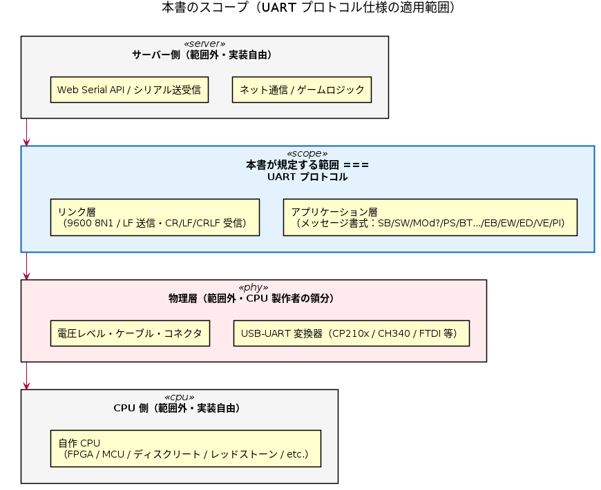
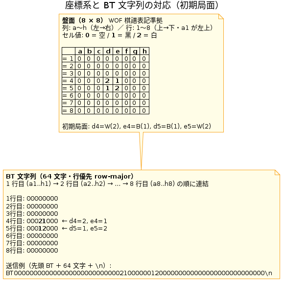
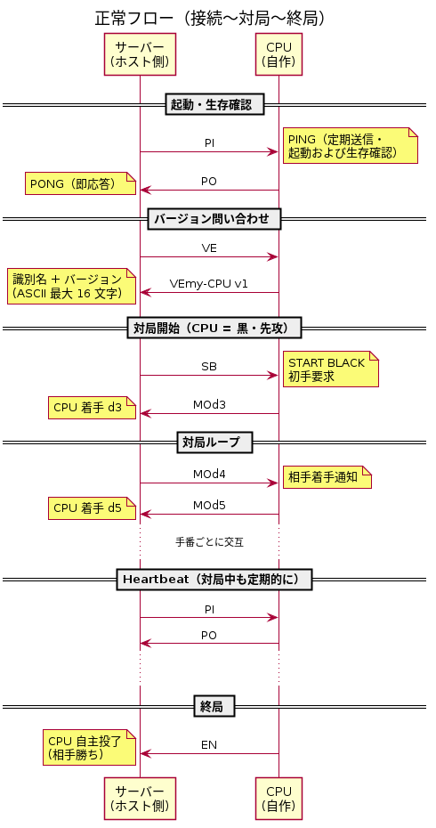
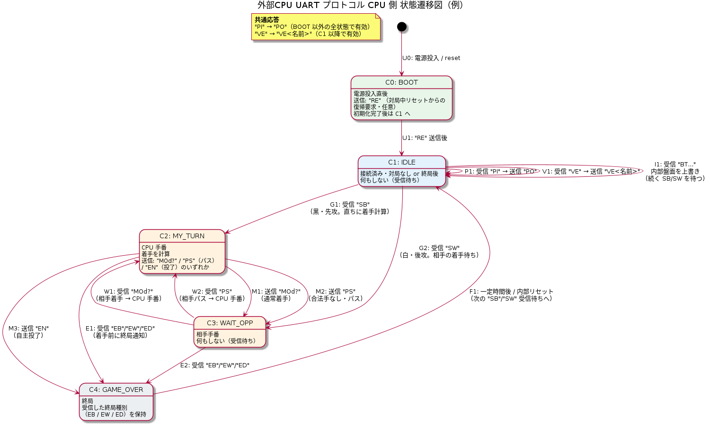
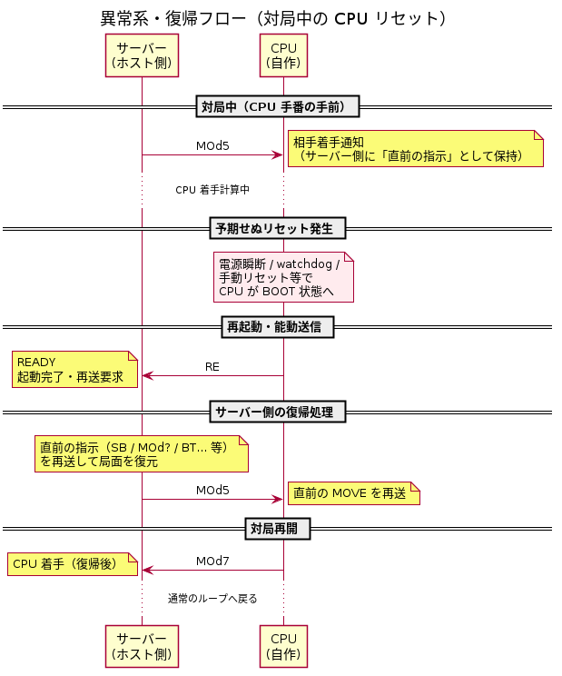
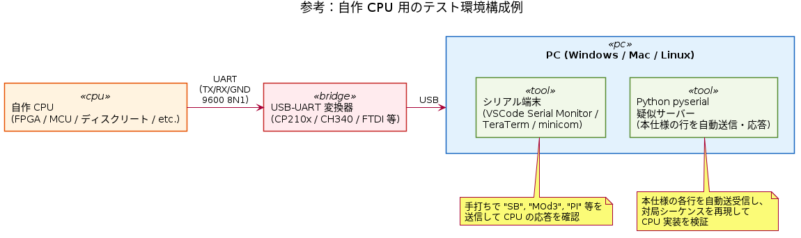

# リバーシ UART プロトコル仕様（ドラフト v0.1）

2026-04-22

提案者: [tommie.jp](https://tommie.jp)

自作 CPU（FPGA / MCU / ディスクリート CPU 等）を **リバーシチャットサーバー**
のブラウザクライアントに UART 経由で接続し、ネット越しに他プレイヤーと対戦する
ための通信プロトコル仕様。CPU 製作者が本書だけを読めば実装可能なよう、
サーバー側の実装詳細には踏み込まない。

> **注記**: 「オセロ」は株式会社メガハウスの登録商標です。本書では「オセロ」の
> 代わりに一般名詞である「リバーシ」を使用しています。

## 目次

- [1. この文書のステータス](#1-この文書のステータス)
- [2. スコープ](#2-スコープ)
- [3. リンク層](#3-リンク層)
- [4. 文字コード・改行](#4-文字コード改行)
  - [4.1 仕様違反受信時の扱い](#41-仕様違反受信時の扱い)
- [5. バッファ・タイムアウト](#5-バッファタイムアウト)
- [6. メッセージ書式](#6-メッセージ書式)
  - [6.1 サーバー → CPU（CPU への入力）](#61-サーバー--cpucpu-への入力)
  - [6.2 CPU → サーバー（CPU からの応答）](#62-cpu--サーバーcpu-からの応答)
- [7. 座標・盤面の向き](#7-座標盤面の向き)
- [8. プロトコル設計の指針](#8-プロトコル設計の指針)
- [9. 正常フロー](#9-正常フロー)
- [10. CPU 側 状態遷移図（例）](#10-cpu-側-状態遷移図例)
- [11. 状態遷移表](#11-状態遷移表)
- [12. 異常系・復帰フロー](#12-異常系復帰フロー)
  - [12.1 盤面乖離からの復帰（RS）](#121-盤面乖離からの復帰rs)
- [13. 参考](#13-参考)
- [14. 検討事項（未確定）](#14-検討事項未確定)
  - [14.1 パスの扱い](#141-パスの扱い)
  - [14.2 無効な着手 / 不正応答への対応](#142-無効な着手--不正応答への対応)
  - [14.3 状態遷移表の未確定セル](#143-状態遷移表の未確定セル)
- [15. ClaudeCode のレビュー](#15-claudecode-のレビュー)
  - [15.1 自作オセロ CPU 作成者の目線](#151-自作オセロ-cpu-作成者の目線)
  - [15.2 FPGA 制作者の目線](#152-fpga-制作者の目線)
  - [15.3 リバーシゲーマーの目線](#153-リバーシゲーマーの目線)
  - [15.4 サーバー制作者の目線](#154-サーバー制作者の目線)
  - [15.5 全体の総評](#155-全体の総評)
- [16. 本書に追記を検討するなら](#16-本書に追記を検討するなら)

## 1. この文書のステータス

本書は**ドラフト v0.1** です。仕様は確定していません。ご意見・ご指摘を募集しています。

## 2. スコープ

本書が規定するのは **UART 上で流れるバイト列**（リンク層以上のアプリケーション
プロトコル）のみ。



PlantUML ソース: [61-scope.puml](61-scope.puml)

| レイヤ | 規定範囲 | 備考 |
| ------ | -------- | ---- |
| アプリケーション（メッセージ書式・状態遷移） | ✅ 本書 | |
| リンク層（ボーレート・バイト形式） | ✅ 本書 | |
| 物理層（USB-UART 変換器・電圧レベル・ケーブル・コネクタ） | ❌ 範囲外 | CPU 製作者の領分 |
| ホスト側（ブラウザ / Web Serial / ネットワーク） | ❌ 範囲外 | サーバー側の実装依存 |

**前提**: ホスト側 PC の USB ポートに USB-UART 変換器を挿し、その先の UART 線が
CPU と接続されている。バイト列が双方向に流れる状態までは物理的に成立している。

## 3. リンク層

- **ボーレート**: 9600 / 38400 / 115200 bps などから選択（ホスト側 UI で指定、CPU 側に合わせる）
- **フレーム**: 8N1（データ 8 bit、パリティなし、ストップ 1 bit）
- **フロー制御**: なし
- CPU 製作者は自分の CPU が安定動作する範囲でボーレートを選んでよい

## 4. 文字コード・改行

- ASCII（人間がシリアルモニタでデバッグできる）
- **改行は LF (`\n`, 0x0A) のみ**。送受信とも厳密に LF。CR (`\r`) / CRLF は不許可。
- **コマンドは大文字のみ**。`VE`, `PI`, `SB`, `MO`, `PA`, `BO`, `EB`, `EW`, `ED`, `PO`, `EN`, `RE`, `ER`, `ST`, `NC`, `RS` の各キーワードは英大文字で送受信する。小文字 (`pi` 等) は仕様違反。
- **MO 等の座標は小文字のみ**（オセロ棋譜の慣習: `MOd3` は OK, `MOD3` は不可）
  - 列インデックス = `ch - 'a'`、行インデックス = `ch - '1'`

### 4.1 仕様違反受信時の扱い

上記規定に反する受信（小文字コマンド、CR 混入、未知コマンド等）を受け取ったら、
ホスト・CPU ともに **`ER\n` で応答する**。送り手は §6.2 #7 の規定通りログに記録
するだけで、自動再送は行わない（無限ループ防止）。

## 5. バッファ・タイムアウト

| 項目 | 値 | 備考 |
| ---- | -- | ---- |
| CPU 側 RX バッファ | **80 バイト以上推奨** | 最長メッセージは `BO` (67 バイト) |
| 文字間タイムアウト | **100 ms** | 行途中で次文字が 100 ms 来なければパーサをリセットし、次の `\n` まで読み飛ばす |
| `PI`/`PO` ラウンドトリップ | サーバー側は 1000 ms 待機、3 連続失敗で切断扱い | CPU 側は受信即応答 |
| 着手タイムアウト | サーバー側 UI で設定可（デフォルト 30 秒） | 超過時はサーバー側で警告表示 |

## 6. メッセージ書式

凡例: 必須 = ✔ / 任意 = 空欄

### 6.1 サーバー → CPU（CPU への入力）

| # | 書式 | 必須 | 正式名称 | 意味 |
| -- | ---- | ---- | ---- | ---- |
| 1 | `SB\n` | ✔ | START BLACK | あなたは黒（先攻）。最初の手を指してください |
| 2 | `SW\n` | ✔ | START WHITE | あなたは白（後攻）。相手の手を待ってください |
| 3 | `MOd3\n` | ✔ | MOVE | 相手が d3 に置いた |
| 4 | `PA\n` | ✔ | PASS | 相手がパス |
| 5 | `BO[盤面状態64文字]\n` | | BOARD | 局面全体投入（**64 文字固定・行優先**。空きマスは `0`、黒 `1`、白 `2`。接続直後の同期・復帰時に使用。リセット復帰に対応しない CPU は無視してよい）。詳細は §7 座標・盤面の向きを参照。例: `BO0000000000000000000000000002100000012000000000000000000000000000\n` |
| 6 | `EB\n` | ✔ | END BLACK | 終局・黒勝ち |
| 7 | `EW\n` | ✔ | END WHITE | 終局・白勝ち |
| 8 | `ED\n` | ✔ | END DRAW | 終局・引分 |
| 9 | `VE\n` | ✔ | VERSION | バージョン問い合わせ。CPU は `VE<プロトコル版2桁><識別名>\n` で応答する（§6.2 #4 参照）。例: `VE01tommie-CPU v1\n` |
| 10 | `PI\n` | ✔ | PING | ピング |

**`MO` の書式**: `MO` 直後は **必ず列 (`a`-`h`) + 行 (`1`-`8`) の 2 文字**。
スペース・区切り文字は挟まない（例: `MO d3` や `MOd-3` は不可）。
座標は小文字のみ受理（`MOd3` は OK、`MOD3` は不可。§4 参照）。

### 6.2 CPU → サーバー（CPU からの応答）

| # | 書式 | 必須 | 正式名称 | 意味 |
| - | ---- | ---- | ---- | ---- |
| 1 | `MOd3\n` | ✔ | MOVE | d3 に置く |
| 2 | `PA\n` | ✔ | PASS | パスする |
| 3 | `PO\n` | ✔ | PONG | `PI\n` への応答 |
| 4 | `VE<NN><名前>\n` | ✔ | VERSION | `VE\n` への応答。`<NN>` は**プロトコルバージョン 2 桁**（ASCII 数字、必須）。`<名前>` は識別名・バージョン文字列（ASCII、最大 16 文字）。当面は `01`（ドラフト v0.1）のみサポート。例: `VE01tommie-CPU v1\n` |
| 5 | `EN\n` | | END | 投了 |
| 6 | `RE\n` | | READY | 起動完了。ホスト側は `RE` 受信で直前の指示を再送する（対局中のリセット復帰用。24/7 ボット運用では推奨） |
| 7 | `ER\n` | | ERROR | 仕様違反受信への応答。小文字コマンド、CR 混入、未知コマンド、不正着手 (`MOz9` 等) を受信した場合に返す。受信側は §4.1 の通りログ記録のみで自動再送しない |
| 8 | `ST<text>\n` | | STATUS | 思考中の状態を任意タイミングで送信。例: `ST d=12 n=45000\n`。サーバー側は UI 表示やログに使用。NBoard Protocol の `status` 相当 |
| 9 | `NC<nodes>,<ms>\n` | | NODESTATS | 着手送信直後に探索統計を返す任意応答。例: `NC125000,450\n`（探索ノード数と所要ミリ秒）。NBoard Protocol の `nodestats` 相当 |
| 10 | `RS\n` | | REQUEST SYNC | 盤面再同期要求。CPU が自盤面とホスト盤面の乖離を検知した場合（例: ホストから届いた `MO?` が自盤面では非合法）に送る。ホスト側は現在の局面を `BO<盤面状態64文字>\n` で送信し、続けて**直前に送った指示**（通常は `MO?\n`）を再送する。詳細は §12 異常系・復帰フロー参照 |

## 7. 座標・盤面の向き

オセロ棋譜の標準表記（世界オセロ連盟 WOF 流）に準拠する。

- **列**: `a`〜`h`（左→右）
- **行**: `1`〜`8`（上→下、`a1` が左上）
- **移動コマンド内の座標は小文字**（列 `a`〜`h`）で送信。例: `MOd3`, `MOh8`, `MOa1`
- 大文字も受理する（§4. 文字コード・改行参照）
- **BO の並び順**: 行優先で `a1, b1, c1, ... h1, a2, b2, ... h8` の 64 文字（= row-major、行 1 → 行 8）
- **初期局面**: `d4=W(2), e4=B(1), d5=B(1), e5=W(2)`（他はすべて空 `0`）
  → `0000000000000000000000000002100000012000000000000000000000000000`

CPU 内部の盤面表現（`row*8+col` / `col*8+row` / ビットボード等）は **実装者の自由**。
本書はワイヤ上のシリアライズ順のみを規定する。



PlantUML ソース: [61-board-coord.puml](61-board-coord.puml)

## 8. プロトコル設計の指針

- **1 行 1 メッセージ**。状態を持たないので CPU 側パーサが単純
- **CPU は受信内容を echo してはならない** — machine-to-machine プロトコルなので
  受信ストリームにエコーが混ざると解析が壊れる。ホスト側は万一 echo されても
  頑健にパースする
- **再送はしない** — CPU の応答待ちはタイムアウトまで黙って待つ
- **`RE\n`（READY）受信時**、ホスト側は直前の指示を再送する（起動タイミング吸収）。
  24/7 ボット運用で CPU が単独リセットした場合の復帰手段として重要
- **現在状態で無効なコマンド**（例: IDLE で `MOd?` 受信）は **黙って捨てる**
  （`\n` まで読み飛ばしてパーサリセット）。実装者の裁量で `ER\n`（任意、
  パラメータなし）を返してよい

## 9. 正常フロー

シリアル接続確立後の通信例。以下は `\n` 省略表記。

凡例:

- `>` CPU → サーバー
- `<` サーバー → CPU

```text
< PI                    PING（起動・生存確認）
> PO                    PONG
< VE                    VERSION 問い合わせ
> VE01tommie-CPU v1     VERSION 応答（先頭 2 桁はプロトコルバージョン）
< SB                    START BLACK（黒先攻・初手要求）
> MOf5                   MOVE f5（CPU 着手・黒の代表的初手/虎定石の起点）
< MOd6                   MOVE d6（相手着手通知・虎定石の白応手）
  ...（以下、手番ごとに交互。サーバーは定期的に PI を挟み heartbeat 確認）
< PI
> PO
  ...
> EN                    END（CPU 投了・終局）
```

**起動検出は PI/PO 主導**。サーバーが能動的に `PI` を送り CPU が `PO` で応える構造
にしているため、シリアル接続のタイミングや CPU の起動順序に依存しない
（CPU 側は純粋リアクティブで実装できる）。



PlantUML ソース: [61-flow-normal.puml](61-flow-normal.puml)

## 10. CPU 側 状態遷移図（例）

以下の状態遷移は CPU 実装の **一例**。本書のプロトコル意味論（メッセージ書式・
タイミング要件）さえ満たせば、CPU 内部の状態表現は実装者の自由。

<!-- markdownlint-disable-next-line MD033 -->


PlantUML ソース: [59-state-external-cpu.puml](59-state-external-cpu.puml)

基本は純粋リアクティブ（サーバーからの受信に反応して返すだけ）。
能動送信は BOOT 直後の `RE\n`（対局中リセットからの復帰要求）のみ。

| 状態 | 役割 |
| ---- | ---- |
| C0: BOOT | 電源投入直後。`RE` 送信後に IDLE へ |
| C1: IDLE | 接続済み・対局なし or 終局後。`SB`/`SW` を待つ。終局種別（`EB`/`EW`/`ED`）が必要なら内部変数に保持 |
| C2: MY_TURN | CPU 手番。着手計算後 `MOd?` / `PA` / `EN` のいずれかを送信 |
| C3: WAIT_OPP | 相手手番。受信待ち |

**終局時の振る舞い**:

- CPU が `EN\n`（投了）を送信した場合、**サーバーは応答を返さず**次の `SB`/`SW`
  まで沈黙する。CPU は `EN` 送信後ただちに C1 (IDLE) へ遷移してよい
- サーバー判定の終局（`EB`/`EW`/`ED`）を受信した場合も、CPU は C1 (IDLE) へ遷移し、
  次の `SB`/`SW` を待つ
- 終局種別（勝敗）を LED や LCD 等に表示したい場合、状態ではなく CPU 内部変数として保持する
  （プロトコル上は IDLE と区別しないため）

**共通応答（副作用なし）**:

- 受信 `PI` → 送信 `PO`（**全状態で有効**。BOOT 中を除き常に応答）
- 受信 `VE` → 送信 `VE<NN><名前>`（**C1 (IDLE) 以降で有効**。BOOT 中は応答しない。`<NN>` はプロトコルバージョン 2 桁）

> **注記（送受独立）**: UART の TX/RX は独立しており、CPU 側は送信中でも受信を取りこぼしてはならない。
> 例えば `VE<NN><名前>\n` を送出している最中にサーバーから `MOd?\n` が到着することがある。
> CPU は RX を割り込み／FIFO 等でバッファリングし、送信完了後に解釈すること
> （半二重プロトコルではない）。

**盤面同期**:

- 受信 `BO...` は **C1 (IDLE) でのみ** 受理し、内部盤面を上書き。続く `SB`/`SW` を待つ
  （接続直後の同期・リセット復帰時に使用。対局中は受理しない）

## 11. 状態遷移表

上の状態遷移図を **状態 × 受信イベント** のマトリクスで表したもの
（State Transition Table / Mealy マシン形式）。縦欄に CPU 側の状態、横欄に
サーバーから受信するメッセージを並べ、セルに「アクション ／ 遷移先」を書く。
実装者は状態ごとに「どのイベントで何をして、どの状態に行くか」を一覧できる。

| 状態 ＼ 受信 | `PI` | `VE` | `SB` | `SW` | `MOd?` | `PA` | `BO...` | `EB`/`EW`/`ED` |
| --- | --- | --- | --- | --- | --- | --- | --- | --- |
| C0: BOOT | —¹ | —¹ | —¹ | —¹ | —¹ | —¹ | —¹ | —¹ |
| C1: IDLE | 送 `PO` | 送 `VE 名` | →C2 | →C3 | — | — | 盤面上書き | — |
| C2: MY_TURN² | 送 `PO` | 送 `VE 名` | ※ | ※ | — | ※ | — | →C1 |
| C3: WAIT_OPP | 送 `PO` | 送 `VE 名` | ※ | ※ | 盤面更新 ／ →C2 | →C2 | — | →C1 |

**凡例**:

- `送 X`: メッセージ `X\n` を送信（留まる）
- `→Cn`: 状態 Cn へ遷移
- `—`: 黙って破棄（パーサをリセットして次の `\n` まで読み飛ばす。任意で `ER\n` を返してよい）
- `※`: **検討事項（未確定）** — §[14. 検討事項（未確定）](#14-検討事項未確定)参照

**注**:

- ¹ BOOT 中は任意の受信を破棄。CPU の初期化完了後に `RE\n` を能動送信して C1 (IDLE) へ遷移
- ² C2 (MY_TURN) は着手計算中の一時状態。計算完了後に CPU が自発的に
  `MOd?\n` / `PA\n` / `EN\n` を送信し、それぞれ C3 / C3 / C1 へ遷移する
  （受信イベントによる遷移ではなく、CPU 内部の自発遷移）
- SB/SW による対局開始時の手番割当: `SB` を受けたら黒（先攻）として C2 (MY_TURN) へ、
  `SW` を受けたら白（後攻）として C3 (WAIT_OPP) へ

## 12. 異常系・復帰フロー

対局中に CPU が予期せずリセットされた場合、CPU は起動直後に `RE\n` を能動送信する。
サーバーは `RE` を検知したら**直前に送った指示（`SB` / `MOd?` / `BO...` 等）を再送**
して局面を復元する。

```text
（対局中に CPU 電源リセット）
> RE                    READY（再起動完了・再送要求）
< MOd5                   サーバーが直前の MOVE を再送
> MOd7                   CPU 着手
  ...
```



PlantUML ソース: [61-flow-recovery.puml](61-flow-recovery.puml)

### 12.1 盤面乖離からの復帰（`RS`）

対局中に CPU が「ホストから届いた相手の `MO?` が自盤面では非合法」など、
**自盤面とホスト盤面の乖離**を検知した場合、CPU は `RS\n`（REQUEST SYNC）を
能動送信する。ホストは現在の局面を `BO<盤面状態64文字>\n` で送り、続けて
**直前に送った指示**（通常は相手の `MO?\n`）を再送する。

```text
（CPU が ホスト→CPU の MO?\n を自盤面で非合法と判定）
> RS                    REQUEST SYNC
< BO0000...             サーバーが現在の局面を送信
< MOb5                   サーバーが直前の MOVE を再送
  （CPU は BO で盤面を上書きしてから MO を処理）
> MOd7                   CPU 着手
  ...
```

`RS` は任意実装。CPU が盤面管理をホスト丸投げで行う実装（毎手 `BO` 同期）では
使わなくてよい。一方、CPU 側が独自に盤面を保持する実装では、サーバー側バグや
ビット化け等による乖離から自律復帰できる手段として推奨する。

**再試行ポリシー（ホスト側）**: `RS` → `BO` + 指示再送で解消せず `RS` が連続して届く
場合、ホスト側は一定回数（例: 3 回）を上限に試行を打ち切って対局を中断してよい。
tommieChat リファレンス実装は上限超過時に CPU を反則負け扱いとして投了 RPC を
呼び出す。

## 13. 参考

自作 CPU 用のテスト環境は CPU 製作者が独自に用意してよい。典型的な構成例を下図に示す。



PlantUML ソース: [61-test-setup.puml](61-test-setup.puml)

- CPU → USB-UART 変換器 → PC の USB ポート、という物理接続を組む
- PC 側の端末ソフト（VSCode Serial Monitor / TeraTerm / minicom 等）で手動コマンドを
  投げて挙動確認するのが一般的
- Python pyserial による疑似サーバーの例: 本仕様の各行を手打ち／自動応答させる
  だけで CPU の実装を検証できる

## 14. 検討事項（未確定）

本書のドラフト段階で仕様が固まっていない項目。実装者からのフィードバックを募集。

### 14.1 パスの扱い

- 合法手がない場合のパスは公式リバーシルールで強制。`PA\n` を CPU から送る
- **未確定**: 合法手があるのに CPU が `PA\n` を返してきた場合、サーバーはどう扱うか
  - 案 A: そのままパス扱い（CPU の自由意志を尊重、ただし反則負け扱いしない）
  - 案 B: 不正応答として扱い、切断または `ER` を返す
  - 案 C: 合法手チェックはサーバー側で行い、不正なら黙って無視して再度手番通知
- **未確定**: サーバー → CPU の `PA\n`（相手パス通知）は、相手に合法手がない時のみ
  送られるのか、相手の自主パス（実装によってはありうる）も含むのか

### 14.2 無効な着手 / 不正応答への対応

**決定: 案 B を採択** — 不正時は `ER\n` を返し、送信側は再試行可 (§4.1 参照)。

- 対象: `MOz9` のような範囲外座標、合法でない座標 (`MOa1` が非合法のとき等)、
  小文字コマンド、CR 混入、未知コマンド全般
- 受信側 (CPU / サーバ両方) は `ER\n` を返す。送信側は §6.2 #7 に従いログ記録のみで
  自動再送はしない (無限ループ防止)。CPU は再度 `MO?` や `PA` を送り直してよい

参考: 当初は以下を検討していた。

- 案 A: サーバーが合法性を判定し、不正なら黙って無視して再度 `MO?` を待つ
- 案 B: 不正時は `ER\n` を返し、CPU 側は再試行 ← **採択**
- 案 C: 不正時は対局を中断し、反則負けとしてサーバー側で `EW`/`EB` を送る

### 14.3 状態遷移表の未確定セル

§11. 状態遷移表で `※` で示したセルの扱い。

- **C2 (MY_TURN) / C3 (WAIT_OPP) 中に `SB` / `SW` を受信**: 対局中に新規対局通知が
  来た場合の挙動。サーバー側の誤動作か、リセット復帰の意図か判別できない
  - 案 A: 現対局を破棄して新規対局として処理（`SB`→C2 / `SW`→C3）
  - 案 B: 無視（対局中に新規対局は論理的にありえない）
- **C2 (MY_TURN) 中に `PA` を受信**: 自分の手番中に相手パス通知はありえないが、
  防御的に無視するか `ER\n` を返すか

## 15. ClaudeCode のレビュー

本書のドラフトに対して Claude Code に 4 つの視点からレビューを依頼した結果。

<!-- markdownlint-disable MD024 -->

### 15.1 自作オセロ CPU 作成者の目線

#### 良い点

- 2 文字固定ニモニック＋小文字座標で、`ch - 'a'` / `ch - '1'` でインデックス化できる割り切り
- `RE` 再送要求の仕組みが「対局中リセット復帰」という実運用を想定していて親切
- `BO` の行優先 64 文字固定という「シリアライズ順だけ規定、内部表現は自由」の切り分けが明快
- バッファ 80 バイト推奨、`BO` が最長 67 バイトと具体値があるのが助かる

#### 気になる点

1. `MOd3` のパース曖昧性: プリフィックスマッチ型の単純パーサを想定しているなら「`MO` の後ろは必ず 2 文字続く」と明記すると実装が楽になる
2. パスはいつ来るか: `PA\n`（相手パス）がサーバーからなのか、合法手がない時 CPU が返すのか、両方ありうるのか書いていない（※ レビュー時点では `PS` だったが PA に変更済み）
3. 無効着手の扱い: CPU が不正な `MO` を返したらサーバーは何をするか書いていない（切断？ 警告？ 再要求？）
4. `VE` タイミング: 送受は独立（半二重ではない）と明記したほうが FPGA 実装者が迷わない
5. `EN` 投了後の流れ: CPU が `EN` を送った後、サーバーは `EB/EW/ED` を返すのか、何も返さず次の `SB/SW` 待ちになるのか不明
6. 終局後の `BO` 可否: `EB/EW/ED` 受信直後は IDLE なのか GAME_OVER なのか。状態名の C1/C4 の切り分けを明確化

### 15.2 FPGA 制作者の目線

#### 良い点

- ボーレートを CPU 側の都合で選んでよい（9600 でも通る）
- フロー制御なしは FPGA UART の定番実装で扱いやすい
- ASCII/LF のみ送信でシフトレジスタ＋カウンタだけで組める粒度

#### 気になる点

1. 送信側バッファ要件がない: TX 側の最大フレーム長が明記されていない。ROM/BRAM 節約したい作者には助かる
2. 文字間タイムアウト 100ms は誰が測る: CPU 側にもタイマが要るのか、サーバー側だけか
3. 起動時の UART 安定化時間: 電源投入直後のゴミバイトをサーバーが許容するか明記が欲しい
4. ボーレート誤差: FPGA だと分周器の誤差で ±2% くらい出る。「±2.5% まで許容」のような目安があると嬉しい
5. パリティなしの再確認: CPU 作者が勝手にパリティ有りにできるか否か。「8N1 固定」と断言したほうがよい
6. 受信 echo 禁止の理由: FPGA 初心者が UART ループバックでデバッグしがちなので「デバッグ時に echo させたら必ず外してから接続」くらいの注意があると親切

### 15.3 リバーシゲーマーの目線

#### 良い点

- WOF 棋譜表記準拠（a1 左上、a〜h 列、1〜8 行）は世界標準で違和感なし
- 初期局面の記述 `d4=W, e4=B, d5=B, e5=W` は正しい（白が右下対角）
- 「黒先手」が自明の前提になっている

#### 気になる点

1. 開幕手の表記例: `MOd3` が最初に出てくるが、「虎定石」「兎定石」の起点 `f5` のほうがリバーシプレイヤーには通りが良い
2. パスの扱い: リバーシでは「合法手がない時は強制パス」が公式ルール。「合法手があるときにパスしてはいけない」の明記がない
3. 投了 `EN`: WOF 公式では基本的に投了は少ない。「コンピュータ同士ならほぼ使われない」と optional 扱いを明記してもよい
4. 合法手通知がない: 「合法手判定は CPU 側の責務」と一文入れると親切
5. 棋譜記録: 「全着手履歴は本プロトコルでは扱わない（サーバー側が保持）」と明記すると良い
6. 色の数値割当: `0=空 / 1=黒 / 2=白` は一般的だが、`1=黒` の根拠（先手優位／慣習）を 1 行入れてもよい

### 15.4 サーバー制作者の目線

#### 良い点

- `RE` → 直前指示再送、`PI/PO` heartbeat、という役割分担が明快
- `ER` が optional で「ログだけ取って自動再送しない」という割り切りが実装を単純化
- 「現在状態で無効なコマンドは黙って捨てる」方針がサーバー側にも書いてあり、バグの温床になりにくい

#### 気になる点

1. `RE` 再送の「直前指示」の定義: 接続直後／`SB` 直後／一切送っていない状態での `RE` の扱いが不明
2. 複数コマンドの境界: サーバーが連続送信していいか、「1 コマンド送信→応答待ち→次コマンド」なのか。`PI` は非同期でいつでも送れるのか
3. `BO` の送信契機: 接続直後の同期タイミング、`RE` 受信時は `BO` + `SB`/`SW` の 2 つ送るのか、具体例が欲しい
4. ラウンドトリップ失敗の復旧: 切断後の再接続プロトコルが未定義
5. 着手タイムアウト超過時の挙動: 対局継続／強制パス／強制投了のどれか書いていない
6. `EN` 受信後のサーバー義務: CPU の状態を `GAME_OVER` にするため `EW`/`EB` を返す必要があるか
7. CPU のバージョン依存: protocol version を予約しておくと将来の互換性維持で楽
8. 同時接続 1 対 1 前提: プロトコルの前提を明記するとよい

### 15.5 全体の総評

骨格はしっかりしていて、最小実装で動かせる良いドラフト。優先度高めで追記を勧める項目:

1. ✅ **解決** **ステートマシン遷移表に「何を受けたら何に遷移するか」をもう 1 列追加** — CPU 作者・サーバー作者共通の最大の要望
   → §[11. 状態遷移表](#11-状態遷移表) で状態 × 受信イベントのフルマトリクス（Mealy 形式）を追加
2. ⏳ **未対応** **`RE` 再送の具体ケース** — 接続直後／SB 直後／対局中の 3 ケースでサーバーは何を送るか例示
3. ✅ **解決** **無効着手・不正応答時のエラーハンドリング** — CPU 作者が「最悪ケースで何が起きるか」を知りたい
   → §[14. 検討事項（未確定）](#14-検討事項未確定) に 3 案併記で問題提起
4. ⏳ **未対応** **着手タイムアウト超過時のサーバー挙動の明文化**
5. ⏳ **未対応** **合法手判定は CPU の責務** の明示（リバーシ初心者向け）
6. ✅ **解決** **開幕例を `f5` に** — リバーシ文化的に自然
   → §9. 正常フローと 61-flow-normal.puml を `MOf5` / `MOd6` / `MOc3`（虎定石の出だし）に差し替え

<!-- markdownlint-enable MD024 -->

## 16. 本書に追記を検討するなら

リバーシ／オセロ界隈の慣習・他プロトコルとの整合性を踏まえた、本書への
追記候補（調査詳細は [62-リバーシ慣習・定石メモ.md](62-リバーシ慣習・定石メモ.md) 参照）。

- **§13 参考に NBoard Protocol を追加**: 本書と同種の Othello エンジン通信プロトコル。
  CPU 製作者がもう一つの実装例として参照できると設計判断の納得感が上がる
- **§7 座標・盤面の向きに Thor 棋譜形式との互換性を明記**: `MOf5` の `f5` 部分は
  Thor 棋譜 DB（WOF 公式）の座標表記と一致する、という一文があると棋譜解析連携が
  しやすい
- **§14 検討事項に「定石名の自動検出」を追加**: 本書の責務に含めるか否か。
  結論としてはサーバー側機能（CPU は定石名を知る必要がない）とするのが妥当だが、
  設計判断として一度触れておくと将来議論を蒸し返さずに済む
- **§8 プロトコル設計の指針に「持ち時間制御は本書の範囲外」を追加**: WOF 公式は
  30 分切れ負けや Fischer 加算などのルールがあるが、本書は 1 手タイムアウトの
  規定のみで、対局全体の時間管理はサーバー側 UI / ルール層の責務
- **§14 検討事項に「Thor 形式棋譜のエクスポート」を追加**: 本プロトコルの結果を
  Thor 形式に変換してサーバー側で保存するか。CPU とサーバーの境界をどこに引くか
- **★ NBoard Protocol との互換性強化**（詳細は [64-NBoard互換性検討.md](64-NBoard互換性検討.md) 参照）
  - ✅ **反映済み**: `ST<text>\n`（STATUS）、`NC<nodes>,<ms>\n`（NODESTATS）、
    `VE` 応答への `p<N>` プロトコルバージョン付加（いずれも CPU 側の任意実装）
  - 未反映（中〜高コスト）: `SD<n>`（探索深さ指定）、`HI<n>`（候補手問い合わせ）、
    `BH`（Thor 形式での履歴伝達）、GGF 互換モード
